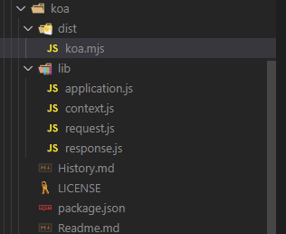

# 手撕koa，从零掌握koa的实现原理（1）
## 了解官方koa的目录
- 图一是`npm`安装的官方`koa`的结构。`koa`就是对node原生的`http`服务进行了封装。各个文件的具体作用如下。
  - `koa/lib/application.js`中是`koa`的整个应用。
  - `koa/lib/context.js`中是`koa`的上下文。
  - `koa/lib/request.js`是用于扩展原生请求的。
  - `koa/lib/response.js`是用于扩展原生响应的。
  - `koa/dist/koa.mjs`用来处理`esModule`的

     

    （图一`node_modules/koa`的目录结构）


- 我们使用`koa`的时候是下面这样。
  ```js
  const Koa = require('koa')
  const app = new Koa()
  ```
- 不知道大家有没有这个疑问，那我们导入的这个`koa`是从哪里来的呢？

  从图二可以看到，在`koa`的`package.json`中`main`的值是`lib/application.js`，在我们导入第三方npm包的时候，`require`会优先导入`package.json`中`main`指定的文件。
 

  （图二node_modules/koa/package.json）
## 我们自己的koa工程目录
> 整个工程叫`koa`，`koa/koa`文件夹存放我们自己实现的`koa`代码，`src`文件夹存放我们的测试代码。


（图三项目工程结构）
## application.js初步实现
> 在我们工程目录`koa/koa/lib`下新建一个`application.js`。
`application.js`的里边主要是导出我们的整个`koa`。回想我们使用`koa`的时候，`koa`是一个类，需要用`new`去调用。
- `koa/koa/lib/application.js`
    ```js
    class Application {
      constructor(){
        console.log('我是Application')
      }
    }

    module.exports = Application
    ```
    我们声明一个`Application`的类，在`constructor`中输出`我是Application`，最后导出`Application`。

- `koa/src/server.js`

  在`koa/src/server.js`中我们导入`Application`类，我们可以在`koa/koa`文件夹下面新建一个`package.json`，里面加入`main`字段，这样我们在导入我们自己的`koa`的时候就会自动去找`main`指定的文件了。
  - `koa/koa/package.json`
      ```json
      {
        "main": "./lib/application.js"
      }
      ```
## 导入Application，测试一下
> 在`src`目录下新建一个`server.js`，我们来写我们的测试代码。
- `koa/src/server.js`
  ```js
  const Koa = require('../koa')
  const app = new Koa()
  ```
  这里`require('../koa')`会导入`koa/koa/package.json`中`main`指定的文件，我们用`node`跑一下`koa/src/server.js`，控制台成功打印见图四。

  

## 今天的实现就到这里，明天继续。
看到这里的兄弟给点个赞吧，万分感谢。