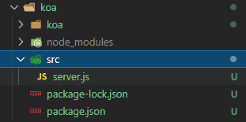
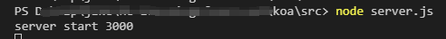
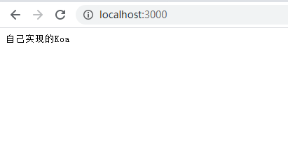

# 手撕koa，从零掌握koa的实现原理（2）
## 前言
- 回顾昨天的内容，我们了解了官方的`koa`的目录，搭建了我们自己的工程结构。
> 整个工程叫`koa`，`koa/koa`文件夹存放我们自己实现的`koa`代码，`src`文件夹存放我们的测试代码。



（图一项目工程结构）

## application.js继续实现
> `koa`实际上就是对`http`模块的一个封装，所以我们需要导入`http`模块，在实现的过程中我们还需要用到`EventEmitter`模块（`node`中自带的发布订阅模块），继承的时候不要忘记调用`super`。我们先初步实现`listen`方法，`listen`方法的主要作用是使用`http`模块开启一个服务。最后我们导出`Application`，进行到这一步我们先来测试一下代码能否走通。
- `koa/lib/application.js`
    ```js
    const http = require('http')
    const EventEmitter = require('events')
    class Application extends EventEmitter {
      constructor(){
        super()
      }
      handleRequest = (req, res) => {
        res.statusCode = 200
        //因为我们响应的是中文，所以需要设置一下content-type，否则浏览器会显示乱码
        res.setHeader('content-type','text/plain;charset=utf-8')
        res.end('自己实现的Koa')
      }
      listen(){
        const server = http.createServer(this.handleRequest)
        server.listen(...arguments)
      }
    }

    module.exports = Application
    ```
- 需要注意的小点

  在实现`listen`方法的时候，我们把`http.createServer`的回调函数提取了出去。
  那我们的`handleRequest`方法就需要这样写
  ```js
  handleRequest = () => {

  }
  ```
  不能这样写
  ```js
  handleRequest(){

  }
  ```
  否则我们的`this`指向会出现问题，或者我们`listen`方法中这样写,使用bind函数改变一下`this`指向，如果使用了`bind`，那我们的`handleRequest`方法就不需要写成箭头函数了，两种写法选择一个就好。
  > 如果对`this`的指向不是很了解，推荐文章：[深入JS 之 面试官经常问的 THIS 闭包 let\const\var 你会了吗？](https://juejin.cn/post/6994973943689904165)」
  ```js
  listen(){
    const server = http.createServer(this.handleRequest.bind(this))
    server.listen(...arguments)
  }
  ```
## 测试一下我们的Application
做到这一步我们先测试一下我们的服务能否正常开启。
- `koa/src/server.js`
  在`koa/src/server.js`中我们开启`3000`端口，看看我们的代码能否运行成功。
  ```js
  const Koa = require('../koa')
  const app = new Koa()

  app.listen(3000,() => {
    console.log('server start 3000');
  })
  ```
## 测试结果
我们使用`node`跑一下`koa/src/server.js`文件。
- 控制台打印

  
- 浏览器访问一下`localhost:3000`

  
