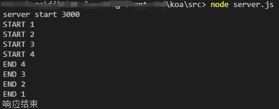

# 手撕koa，从零掌握koa的实现原理（5）

## 往期更文

[手撕koa，从零掌握koa的实现原理(1)](https://juejin.cn/post/7054475037725687822)

[手撕koa，从零掌握koa的实现原理(2)](https://juejin.cn/post/7054747204770070564)

[手撕koa，从零掌握koa的实现原理(3)](https://juejin.cn/post/7055168235649368095)

[手撕koa，从零掌握koa的实现原理(4)](https://juejin.cn/post/7055453382614056967)

[手撕koa，从零掌握koa的实现原理(5)](https://juejin.cn/post/7055909838810775560)

## 前言
- 回顾昨天的内容，我们分别在下面三个文件中，扩展了`context`、`request`、`response`三个对象。
  - `koa/koa/lib/request.js`
    ```js
    const url  = require('url')
    const request = {
      get url(){
        return this.req.url
      },

      get path(){
        let {pathname} = url.parse(this.req.url)

        return pathname
      },

      get query(){
        let {pathname, query} = url.parse(this.req.url, true)
        return query
      }
    }
    module.exports = request
    ```
  - `koa/koa/lib/response.js`
      ```js
        const response = {
          _body:undefined,
          get body(){
            return this._body
          },
          set body(content){
            this.res.statusCode = 200
            this._body = content
          }
        }
        module.exports = response  
      ```
  - `koa/koa/lib/context.js`
    ```js
    const context = {};
    function defineGetter(target, key) {
      context.__defineGetter__(key,function () {
        return this[target][key]
      })
    }

    function defineSetter(target, key) {
      context.__defineSetter__(key,function (value) {
        this[target][key] = value
      })
    }
    defineGetter('request', 'path')
    defineGetter('request', 'url')
    defineGetter('request', 'query')

    defineGetter('response', 'body')
    defineSetter('response', 'body')
    module.exports = context;
    ```
## koa中间件的执行流程是怎么样的呢
- 我们看下面一段代码的执行顺序，引入的是官方的`koa`，`app.use()`这个方法会注册一个中间件，用`node`跑一下这段代码，我们可以看到打印的顺序如图一。
  - `koa/koa/src/server.js`
  ```js
   const Koa = require('koa')
   const app = new Koa()

    app.use((ctx,next) => {
      console.log("START 1");
      next()
      console.log("END 1");
      ctx.body = "<h1>Koa Middleware</h1>"
      console.log("响应结束");
    })
    app.use((ctx,next) => {
      console.log("START 2");
      next()
      console.log("END 2");
    })
    app.use((ctx,next) => {
      console.log("START 3");
      next()
      console.log("END 3");
    })
    app.use((ctx) => {
      console.log("START 4");
      console.log("END 4");
    })
    app.listen(3000, () => {
      console.log('server start 3000')
    })
  ```
  
- 我们可以把上面的代码，看成是这样执行的，下面是伪代码，最后一个`next`可以不写。
  ```js
  (ctx,next) => {
    console.log("START 1");
      (ctx,next) => {
        console.log("START 2");
          (ctx,next) => {
            console.log("START 3");
              (ctx) => {
                console.log("START 4");
                console.log("END 4");
              }
            console.log("END 3");
          }
        console.log("END 2");
      }
    console.log("END 1");
    ctx.body = "<h1>Koa Middleware</h1>"
    console.log("响应结束");
  }
  ```
- `koa`的中间件实现，就类似于函数组合一样，先注册的后执行，还有`koa`中的中间件，在使用的时候我们需要和`async await`一起配合使用，这是因为，如果存在异步逻辑的话，我们最后的结果就会出错。
## 下期预告
手写实现koa的中间件