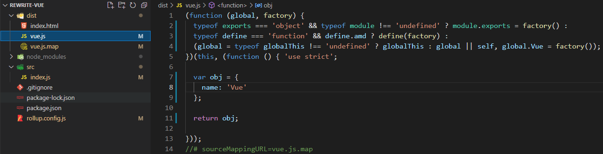
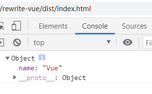

# vue2的实现之搭建rollup打包环境

## 搭建目录结构
> 这里我的根文件夹叫做`rewrite-vue`
- `npm init --y`初始化`package.json`,
- 新建`rewrite-vue/src`目录，用于存放我们的源代码。
- 新建`rewrite-vue/rollup.config.js`，里面是`rollup`的配置文件。
- `dist`目录是我们打包后存放的文件。

   

## 安装依赖
> `npm i rollup @rollup/plugin-babel @babel/core @babel/preset-env @rollup/plugin-node-resolve`
- `rollup`模块打包工具，相比于`webpack`更轻量，常应用于第三方类库的打包，`webpack`更多的应用于工程中。
- `@rollup/plugin-babel`，`rollup`中使用`babel`转义语法的插件。
- `@babel/core`，`babel`的核心包，`@rollup/plugin-babel`会调用它。
- `@babel/preset-env`，`babel`插件的集合，`@babel/core`会使用这些插件，把`JS`的新语法转义为旧语法，提供更好的兼容性。
- `@rollup/plugin-node-resolve`，当我们导入的时候，只需要写文件夹的名称，就会自动查找文件夹下的`index.js`。
   > 没有这个插件的话我们就得这样写，`import a from b/index.js`。有的话这样写`import a from b`就相当于导入`b`文件下的`index.js`了。

## 配置rollup
- 1. 配置入口文件`input:'./src/index.js'`
  2. 配置出口`output`，`file:'./dist/vue.js'`为打包的文件名，
     `name:'Vue'`表示会在全局变量上声明一个`Vue`变量，来保存我们打包的内容，在浏览中就会有一个`window.Vue`的变量，`format:'umd'`代表按照umd的模块化规范打包，`sourcemap:true`代表开启源代码映射。
  3. 配置`plugins`插件，`rollup`的插件都是函数粗腰调用，调用的时候可以传递参数。
     - `babel`插件中配置`exclude:'node_modules/**'`表示不用转义`node_modules`文件夹下的所有内容，`presets: ['@babel/preset-env']`表示`babel`转义语法的预设是`@babel/preset-env`
  - `rewrite-vue/rollup.config.js`
    ```js
    import {babel} from '@rollup/plugin-babel'
    import {nodeResolve} from '@rollup/plugin-node-resolve'

    export default {
      input:'./src/index.js',
      output:{
        file:'./dist/vue.js',
        name:'Vue',
        format:'umd',
        sourcemap:true
      },
      plugins:[
        babel({
          exclude:'node_modules/**',
          presets: ['@babel/preset-env']
        }),
        nodeResolve()
      ]
    }
    ```
## 配置打包命令
在`package.json`中配置`rollup`打包的`scripts`脚本命令`rollup -cw`，`-cw`代表着使用默认的配置文件`rollup.config.js`，监听文件变化重新打包。
- `rewrite-vue/package.json`
  ```json
  "scripts": {
    "dev": "rollup -cw"
  },
  ```
## 测试打包
- `rewrite-vue/src/index.js`
  ```js
  let obj = {
    name:'Vue'
  }
  export default obj
  ```
- 命令行输入`npm run dev`

- 新建`rewrite-vue/dist/index.html`，引入打包后的文件，输出一下`Vue`变量。
  - `rewrite-vue/dist/index.html`
    ```html 
    <!DOCTYPE html>
    <html>
    <head>
      <meta charset="UTF-8">
      <meta http-equiv="X-UA-Compatible" content="IE=edge">
      <meta name="viewport" content="width=device-width, initial-scale=1.0">
      <title>Vue2</title>
    </head>
    <body>
      <script src="./vue.js"></script>
      <script>
        console.log(Vue);
      </script>
    </body>
    </html>
    ```
- 打包后的目录

  

- 打包后的文件`rewrite-vue/dist/vue.js`

  
- 在浏览器打开`rewrite-vue/dist/index.html`
  
  

- 通过我们上面的测试证明我们的`rollup`打包环境已经搭建好了，各位客官可以去试试了。

## 最后

今天是更文第八天加油~

## 往期精彩
