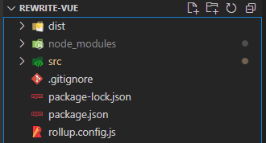

# vue2的实现(2)之初始化选项参数


## 回顾
- 上次内容我们介绍了，创建目录结构，搭建一个`rollup`的打包环境，见图一。

> 这里我的根文件夹叫做`rewrite-vue`
- `rewrite-vue/src`目录，用于存放我们的源代码。
- `rewrite-vue/rollup.config.js`，里面是`rollup`的配置文件。
- `dist`目录是我们打包后存放的文件。

   

   （图一目录结构）

## Vue的构造函数是如何考量的？
- `rewrite-vue/src/index.js`是`Vue`的入口文件，里面是`Vue`构造函数。
- `Vue`类为什么不使用`ES`的`class`来写？
  - 首先我们使用`class`来写，往原型`prototype`上写方法都是下面这样写，写在类的里面。
    ```js
    class Vue{
      constructor(){

      }
      _init(){

      }
    }
    ```
  - 但是这样写，就不方便把不同的方法，拆分到不同的文件中了，但是也可以下面这样写，这样写看起来很别扭，毫无违和感。
    ```js
    class Vue{
        constructor(){

        }
    }

    Vue.prototype._init = function (){
      ...
    } 
    ```
  - 所以`Vue`采用了`ES5`的构造函数的写法，这样也方便扩展，把不同的逻辑，拆分到不同的文件。
  - `rewrite-vue/src/index.js`
    ```js
    import initMixin from './init'

    function Vue(options){
      this._init(options)
    }

    initMixin(Vue)

    export default Vue 
    ```
  - `initMixin`这个方法需要直接调用，作用是扩展`Vue`原型的方法，`_init`方法就是在`initMixin`里面扩展的，这样就可以把他拆分到`rewrite-vue/src/init.js`。
  - 我们使用`Vue`的时候会传入`options`选项对象，里面会有`data`，`props`，`watch`，`computed`等等，像下面这样。
    ```js
    const vm = new Vue({
      data:{
        name:'Vue',
        age:666
      }
    })
    ```
  - `new Vue`会调用`_init`方法传入`options`。
## 初始化数据data
- `new Vue`传入选项之后，`Vue`是如何处理呢？
- `new Vue`会调用`_init`方法这个方法是在`initMixin`中扩展的，下面我们来看一下。
- `rewrite-vue/src/init.js`
  ```js
  import initState from './state'
  function initMixin(Vue){
    Vue.prototype._init = function(options){
      const vm = this
      vm.$options = options
      initState(vm)
    }
  }
  export default initMixin
  ```
- `initMixin`接受`Vue`的构造函数，在扩展`_init`方法，我们要先把用户传入的`options`，保存在实例上，`vm.$options`以后就可以拿到选项对象了。
- 接下来就是初始化状态了，这里的状态是指我们传入的状态相关的数据，比如`data`, `props`, `computed`等等，我们先来初始化数据`data`。因为初始化状态又是独立的逻辑所以我们可以把他拆离出去。
- 新建`rewrite-vue/src/state.js`，里面是关于状态的处理逻辑。
  ```js
  export function initState(vm){
    const opts = vm.options
    if(opts.data){
      initData(vm)
    }
  }

  function initData(vm){
    let data = vm.$options.data
    data = typeof data === 'function' ? data.call(vm) : data
    vm._data = data

    console.log(data)
  }
  ```
- 判断`data`是否存在，存在的话调用`initData`方法进行初始化，`Vue`中`data`可以传递函数或者对象我们得判断一下，然后把数据赋给`vm._data`，给当前实例同步一份，`vm._data`就是我们传入的`data`选项数据了。
## 测试一下
- 运行`npm run dev`，打包一下我们的代码，在`dist/index.html`中输入以下代码,浏览器控制台打印如下.
- `dist/index.html`
  ```html
  <script src="./vue.js"></script>
  <script>
    const vm = new Vue({
      data:{
        name:'vue2',
        age:3
      }
    })
  </script>
  ```

  


今天是更文第九天加油~
看到这里兄弟帮忙点个赞吧
## 往期精彩
