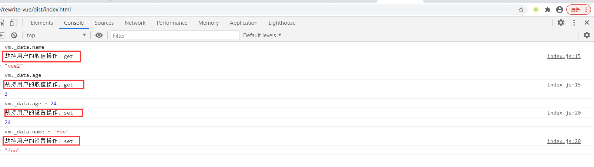

# vue2的实现(2)之对象的劫持


## 回顾
- 上次内容我们介绍了`rewrite-vue/src/state.js`，这个文件中主要做的就是对数据状态的初始化,下面是这个文件夹中的代码,我们拿到`data`后,接下来就到了对数据的劫持操作了。
- `rewrite-vue/src/state.js`
  ```js
  export function initState(vm){
    const opts = vm.options
    if(opts.data){
      initData(vm)
    }
  }

  function initData(vm){
    let data = vm.$options.data
    data = typeof data === 'function' ? data.call(vm) : data
    vm._data = data

    console.log(data)
  }
  ```


## 实现对象的劫持
- 我们接着完成`initData`的方法,我们拿到用户传入的`data`数据之后,需要劫持对象属性的`get` `set`,通过`observe`方法来观测数据.
- `rewrite-vue/src/state.js`
  ```js
  import {observe} from './observe'
  export function initState(vm){
    const opts = vm.options
    if(opts.data){
      initData(vm)
    }
  }

  function initData(vm){
    let data = vm.$options.data
    data = typeof data === 'function' ? data.call(vm) : data
    vm._data = data

    observe(data)
  }
  ```
- `observe`是一个独立的模块,我们需要拆分出去,新建`rewrite-vue/src/observe`文件夹.
- `rewrite-vue/src/observe/index.js`
  ```js
  class Observe {
    consturctor(data){
      this.walk(data)
    }

    walk(data){
      Object.keys(data).forEach(key => defineReactive(data, key, data[key]))
    }
  }

  export function defineReactive(target, key, value){
    Object.defineProperty(target, key, {
      get(){
        console.log('劫持用户的取值操作，get');
        return value
      },
      set(newValue){
        if(newValue !== value){
          console.log('劫持用户的设置操作，set');
          value = newValue
        }
      }
    })
  }


  export function observe(data){
    if(typeof data !== 'object' || data === null){
      return 
    }
    return new Observe(data)
  }
  ```
- `observe`方法,主要是对对象类型的数据做劫持,返回一个`Observe`的实例,把数据传进去,`consturctor`中默认会调用`walk`方法,`walk`方法的作用是循环遍历对象,调用`defineReactive`方法,传入三个参数,`target`是要劫持的目标对象,`key`要劫持的属性,`value`劫持的属性对应的值.因为`defineReactive`方法需要暴露出去,所以这个方法,拆出来写,不写在`Observe`类中.
- `defineReactive`方法的作用是劫持属性的`get` `set` 在用户获取值,设置值的时候我们可以拦截到用户的操作.
## 测试
在上面的代码`rewrite-vue/src/observe/index.js`中,我们在`get` `set` 中做了打印操作,可以来测试一下我们的代码.
- 命令行输入`npm run dev`,打包文件`dist`目录下
- 在浏览器打开`dist/index.html`
- 打开浏览器控制台,在控制台获取或者设置我们传入的`data`数据
- 由于我们在`src/state.js`的`initData`方法中给`vm._data`赋值为我们传入的`data`,也就是劫持过的`data`,我们可以直接通过`vm._data`去访问数据,vm就是`Vue`实例.
- `dist/index.html`中的代码,还是和之前的一样.
  ```html
  <!DOCTYPE html>
  <html>
  <head>
    <meta charset="UTF-8">
    <meta http-equiv="X-UA-Compatible" content="IE=edge">
    <meta name="viewport" content="width=device-width, initial-scale=1.0">
    <title>Vue2</title>
  </head>
  <body>
    <script src="./vue.js"></script>
    <script>
      const vm = new Vue({
        data:{
          name:'vue2',
          age:3
        }
      })
    </script>
  </body>
  </html>
  ```
- 从下面的图可以看出我们的打印已经生效了,证明我们已经拦截到了对象的获取与设置

今天是更文第十天加油~
看到这里兄弟帮忙点个赞吧
## 往期精彩
