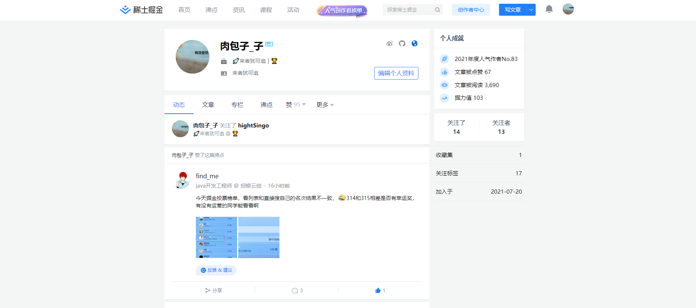

## 往者不可谏 来者犹可追🚀
> 时间真的过的很快啊，感觉昨天还是校园里的匆匆少年呢，转眼间就到了辗转于上班路上的地铁洪流中。早上还是和往常一样，五号线转十号线去公司上班，北京十号线惠新西街南口早上上班时候的样子，有一种学校餐厅的既视感。

## 笔者背景😄
> 2019年的应届毕业生，非科班转行前端（迄今为止1年工作经验），考了两次研，都以失败结果告终，既没考上，也丧失了应届毕业生的最佳就业身份，2020年年初时至疫情最严重的时候，各行各业都是寒冬将至，社会被按下了暂停键，自己也感到压力巨大，10月份来到北京找工作，由于来之前联系过几家公司，所以找工作还是挺顺利的。

## 技术上👨‍💻
找工作的时候也只是简单的会一些前端基础，用过vue2，但是经过自己一
年工作、学习的积累后还是收获了很多。重新学习了JS，对于JS有了更深
的理解。看了vue2的源码，学习了vue3，也看了vue3的源码，学习了TS，
学习了React，也看了React的源码，但是看的有点云里雾里，相比于Vue
的熟练程度，React还要加强。学习了Node，看了Koa和express的源码。

看了这么多的源码，其中对于express的源码设计，惊为天人，感叹道，写
的真是TM太好了，express的源码设计理念，在开发中给了我很大的启发，
在开发完成后，会对代码进行重构该怎样设计，该怎么样写才能更通用，
更解耦。最近在学习前端工程化的东西，在看webpack、vite，自己实在
还是太菜了，我也不理解别人说的卷不卷啥的，只觉得热爱就值得去做，
更何况时代就是这样的，只是庆幸，自己喜欢的，刚好可以是自己的工
作，谁不是为了生存呢。
  
在各种前端技术层出不穷的当下，webgl、数据可视化、lowcode、...等等，向后延伸，后端能力、运维能力，企业的用人要求，也不断地刷新着我们的认知，但是不可否认这真的是一个非常好的时代，在前端工程化迅速袭来的浪潮中，前端工程师再也不是之前的‘前端工程师’了，真的是非常有幸，在自己还算年轻的时候处于这个时代，能够去拥抱新的技术、新的思想。

这一年Layui下线，在我刚学习过前端的时候，也是接触过Layui的，相信在那个前后端还不分离的年代，很多后端同学也是会Layui的，这也是一代人的青春啊。就像作者贤心说的那样，‘使命已达，便纵有万般遗憾，更与何人说？’，是不是有一种‘老兵不死，只是凋零’的悲壮。 身后是万丈深渊，身前是万丈光芒，致敬那些前行路上的技术人，这个时代终将是最美好的时代，也是属于我们的时代。

这一年EDG夺冠，EDG一路过关斩将给🔪，韩国队在冰岛又一次折戟沉沙，冰岛注定是韩国队的伤心地，S3-S11八年的英雄联盟老粉，这估计也是一代人的青春吧。

## 与掘金🏆
2021年7月20加入掘金社区，发过一些水文，蹭过一些活动，得到了很多的礼品，看到很多大佬写的技术文章，还有优秀团队写的文章，收获了很多意想不到的知识，也深感自己的不足，争取早日产出高质量的文章。参加了今年的掘金年度活动，当然我的票都是找亲戚朋友同事拉来的，只是为了想要掘金的周边😂，我女朋友🧝‍♀️充当了拉票的大军。

在掘金薅过的那些羊毛🐏

> 我只是众多前端程序员的一个缩影，普通、平凡，但是在大时代的潮流中，我们一样可以拥有我们自己的风采，怀揣着对技术的热枕，对美好生活的向往，摆脱冷气，去向上走。就像雪中悍刀行中的徐凤年一样，一骑绝尘，向李淳罡一样，天不生我李淳罡，剑道万古如长夜。去拥抱这个前端的新时代，以及，所有那些值得去追求的美好事物。时不我待，舍我其谁。

                                                    2021年12月30日 于北京